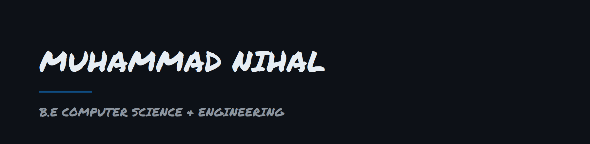

 

3rd-year B.E Computer Science & Engineering student, currently exploring different areas of CS to figure out where I want to specialize.

**Currently**
- Learning the fundamentals across web, ML, and systems before narrowing focus
- Working through coursework projects and personal side-projects
- Open to internships and collaborative projects

**Beyond code**
Football, movies, animation, and music.

**LeetCode**

**Reach me**
- Email: nihalpulikkal82@gmail.com

---
*This profile is a work in progress — more projects coming as I build them out.*
